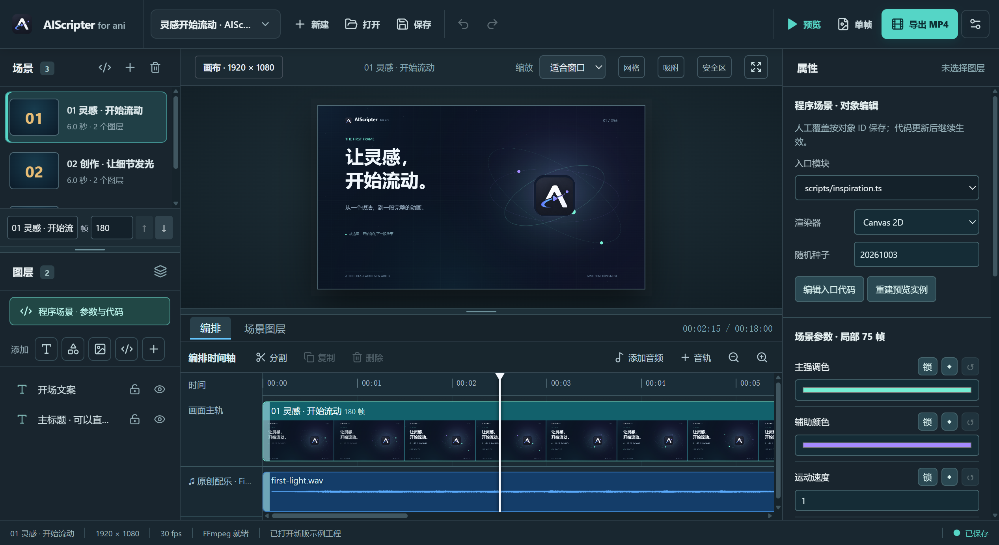

# AIScripter for ani

## Windows 安装版

[下载安装包](https://github.com/YvanLouise/aiscripter-for-ani/releases) · [中文文档](docs/README.md) · [安装与打包](docs/distribution.zh-CN.md) · [外部 AI 创作规范](docs/external-ai-workflow.zh-CN.md)

安装版内置运行时、FFmpeg、SDK、文档和示例，不需要另装 Node.js。首次启动打开 18 秒默认动画《灵感开始流动》，可编辑标题和组件，也可接入外部 AI 的本机 MCP。源码采用 [MIT 许可](LICENSE)，第三方组件保留各自许可。



A Windows-first desktop prototype for animation projects created and revised by external AI coding agents. The editor does not contain an AI model. It opens a documented project folder, lets a person edit the animation, notices external file changes, and exports still frames or MP4 video.

## Run locally

Source development requirements: Node.js 22 or later and npm. MP4 export uses an `ffmpeg` executable on `PATH` with `libx264`, or the development-only Windows binary installed by the npm dependency. The installer ships a separately built encoder with matching source archives. Check a system encoder with `ffmpeg -hide_banner -encoders`.

On Windows, double-click **Start AIScripter.cmd** in this folder. It installs dependencies when needed, builds the current source, and opens the editor. The first launch needs network access for npm packages.

```powershell
npm install
npm run dev
```

`npm run dev` builds and starts Electron. Restart it after changing source files. An editable copy of the dedicated [18-second default animation](examples/default-animation/README.zh-CN.md) opens at launch: three chapters, the supplied brand icon, editable titles and components, and an original stereo score. Playback starts on user action. Its managed copy is separate from older solar-system samples, which remain available with their edits. Untouched copies refresh with a full backup when the bundled template changes; edited copies are preserved. The project menu's **打开新版示例工程** action creates a separate current copy. Use **New** with an empty folder to create a project, **Open** to select a `project.json`, or **Recent projects** to reopen one. The project menu opens the documentation index, version 2 format, or external AI creation guide. `npm run build` performs the TypeScript and production builds; `npm test` runs the project-format and animation tests.

Run `npm run test:default-demo` for native Electron verification and a complete 540-frame 1080p H.264/AAC export to `artifacts/default-animation.mp4`. Screenshots and the UI report are in `.qa/default-animation/`. Older solar-system acceptance artifacts remain in `artifacts/`.

## Project format

Start with the [project documentation index](docs/README.md). External AI agents should read the [creation and revision workflow](docs/external-ai-workflow.zh-CN.md) and the [version 2 project contract](docs/project-format-v2.zh-CN.md) before editing. The machine-readable schemas are in `schema/`. Validate a folder with `npm run validate:project -- <project-folder> --strict-assets`. `examples/solar-system/` is the v1 compatibility example; `examples/sequence-v2/` demonstrates a continuous scene track and global audio; `examples/engine-showcase/` exercises video, audio, 3D, SVG masking, JavaScript, and expressions; `examples/transparent-layer/` demonstrates alpha PNG output.

A local [stdio MCP server](docs/mcp-local.zh-CN.md) provides 18 tools for external coding agents: inspect the open draft, stage/commit changes with undo, import assets, build typed program scenes, capture frames/diagnostics, and queue/cancel MP4 previews. Run `node dist-tools/aiscripter-mcp.cjs --project <project-folder>` with the same folder open in the editor. Disk writes require explicit `--offline`. Run `npm run test:mcp`, `npm run test:ai` and `npm run test:programs` for protocol, editor and v3 runtime verification.

[Format v3 and SDK 1.1.0](docs/project-format-v3.zh-CN.md) add typed Canvas/WebGL2 scenes, local TypeScript components, deterministic animation helpers and persistent create/evaluate/render/dispose workers. Use the scene heading's code button to add one, or open `examples/program-scenes/project.json`. [Phase 3](docs/ai-creation-phase-3.zh-CN.md) adds object selection, canvas transforms, typed public/instance parameters, keyframes, protected human overrides and unbound-object recovery. Run `npm run test:object-edit` for native Electron verification. SDK 1.0.0 projects and legacy scenes remain supported. Simulation snapshots are planned for phase 4.

## Prototype workflow

1. Ask an external AI coding agent to read `docs/project-format-v2.md` and create a project folder.
2. Open its `project.json` in AIScripter. The **Sequence** timeline shows contiguous scene clips, frame thumbnails, global audio tracks, and one draggable playhead. Drag clips to reorder, drag their ends to trim, or use Split, Copy, and Delete. Audio imported through **Add audio** goes on a global track. The **Scene layers** tab retains per-scene layer bars and keyframes. Select a layer; Shift or Ctrl click additional layers and drag them together. Use the primary layer's handles to scale or rotate, edit fields, and add keyframes with the diamond buttons. Drag diamonds in the layer timeline to move keyframes; Shift click to select several keys on one layer, then copy, paste at the playhead, or delete them together. Select a numeric keyframe to edit its outgoing Bezier easing curve in the Inspector. Use an animation preset for common entrances and exits, or apply a safe math expression to a numeric property.
3. Edits autosave after 2.5 seconds of inactivity, or use **Save** immediately. Use **Check** to inspect the current project structure and missing resources. Ask the external agent to read the current project and modify a specific object while keeping the others intact.
4. The editor reloads external changes when there are no unsaved local edits. If there are unsaved edits, it offers reload or save a local copy.
5. Use **Settings** to choose output dimensions, a frame rate from 1 to 120 fps, quality, format, and full-project, current-scene, or global-frame-range output. MP4 dimensions must be even. Export a PNG of the current frame, MP4, WebM, GIF, or a PNG sequence. Transparent output is available for PNG, PNG sequences, and WebM. Changing output fps preserves project duration by sampling frames from the source timeline.

Legacy custom scripts use a fresh module worker per frame in a sandboxed Electron guest renderer. v3 program scenes reuse bounded workers and preloaded resources, with analytic frame evaluation and explicit seeded random channels. Both adapters disable Node integration and restrict network/project paths through the guest session, CSP and canonical path checks. A timed-out worker is terminated; native layers and the project remain editable.

## Current limits

- The editor supports text, shape, image, SVG, video, audio, GLB/glTF, and Canvas 2D/WebGL2 custom layers. Numeric keyframes support linear or cubic Bezier interpolation, and numeric expressions support frame-based formulas. Project-local JSON can bind text, color, visual filters, 3D view controls, and custom parameters. Visual layers support masks, blend modes, filters, crop, text styling, and basic shadows. Scene and global audio clips support fades, loops, volume, and mute. Layer locks, layer ordering, resource browsing and repair, project search, history snapshots, and disk-version comparison are available.
- Video and 3D rendering depend on Chromium codec and WebGL support. Scene audio gain is evaluated across visible frames; export approximates changing gain within 0.001. v3 supports reusable local Canvas components and per-object human overrides. Simulation snapshots, a new Three.js adapter, state transitions, multi-project references and automatic merge remain pending.
- The installer includes FFmpeg 9.0.2 with GPL-3.0-or-later licensing and complete corresponding sources in the same release. The application is MIT licensed; third-party components retain their licenses. The first installer is unsigned and is published as a preview release.
