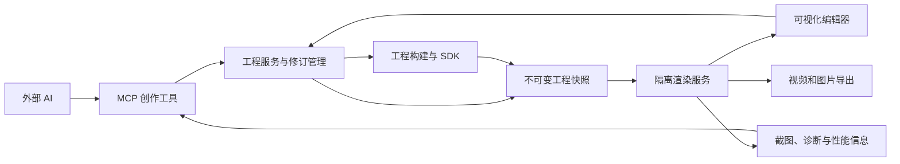

# AIScripter for ani：AI 创作能力优化方案

日期：2026-10-02。状态：按阶段实施中。本文保留原架构提案；首轮 MCP 草稿闭环见[首轮记录](ai-creation-phase-1.zh-CN.md)。第二轮程序场景的已冻结字段、SDK 和实际限制见 [v3 规范](project-format-v3.zh-CN.md)，下文未来能力不能直接作为已实现契约。第 2 节记录的是实施前状态。

## 1. 目标与范围

将软件发展为可编程动画创作环境：外部 AI 能编写和组合场景、观察渲染结果、读取诊断并持续修正；用户能通过画布、属性和时间轴调整这些场景，调整结果在 AI 续改后继续有效。

首发继续采用 Windows、本机运行、外部 AI 接入和本机 FFmpeg。保留现有场景编排、全局音轨、资源管理、保存历史和导出能力。此次优化不引入云端渲染、团队协作或软件内模型订阅。

三个核心成果：

1. AI 可以完成“检查现状 → 修改 → 校验 → 看画面 → 修正 → 交付”的闭环。
2. AI 可以创作包含可复用组件、对象层级和复杂算法的场景；常见效果不需要重写底层绘制代码。
3. 人工修改以稳定对象和属性为单位保存，AI 更新场景代码后仍可应用。

## 2. 当前能力与实际缺口

以下判断来自当前源码，不代表原设计稿所有功能都已完成。

| 当前实现 | 主要缺口 | 优化方向 |
| --- | --- | --- |
| v2 场景包含扁平图层，支持原生媒体、表达式和 custom | 缺少场景组件、父子对象和独立实例参数 | 增加对象树与组件契约 |
| custom 提供 Canvas 2D 或 WebGL2，工程内模块可互相导入 | 缺少统一的高层动画 SDK、依赖打包和工程字体加载 | 提供类型化 SDK、受控构建及资源 API |
| 每个 custom 图层、每帧创建 Worker，再执行 setup/render | GPU、资源和脚本反复初始化；连续模拟难以跳转 | 增加明确的生命周期和模拟状态管理 |
| custom 输出 ImageBitmap，外部编辑器只能修改整层与简单参数 | 脚本内部对象无法被选择或逐项调整 | 返回编辑描述，保存对象属性覆盖 |
| MCP 提供规范读取、磁盘检查、文件读取和校验 | 无法修改、获取未保存状态、渲染或读取实时诊断 | 增加与编辑器连接的创作工具 |
| 单个 JSON 文件以临时文件替换 | 多文件更新整体不具备事务恢复；独立 MCP 不知道编辑器草稿 | 建设工程服务、事务日志和修订检查 |
| 缩略图和导出已有独立隐藏窗口 | 尚无统一作业调度；导出资源根仍是全局状态 | 建设基于快照的渲染服务 |

不以解除脚本的网络、Node.js、系统命令权限来提高创作能力。工程构建与资源导入由宿主执行；动画代码在隔离环境中使用明确的渲染和资源接口。

## 3. 总体架构



职责分为四层：

| 层 | 职责 | 关键约束 |
| --- | --- | --- |
| 工程服务 | 草稿、磁盘版本、事务、撤销、人工覆盖、资源索引 | 编辑器与 MCP 使用同一套变更规则 |
| 创作 SDK 与构建 | 对象描述、动画函数、组件、资源、类型检查和打包 | 工程明确记录所需 SDK 与依赖版本 |
| 隔离渲染服务 | 按时间求值、渲染、模拟恢复、截图与诊断 | 预览、缩略图、AI 截图和导出共享求值逻辑 |
| 编辑与 AI 接入 | 画布、时间轴、对象树、公开属性、MCP 工具 | 通过工程服务提交修改，使用稳定对象 ID |

先复用已有渲染器和编辑器，逐步抽出服务。首轮渲染作业可以串行运行；在资源根和 Worker 状态完成隔离后，再引入受限并发。

## 4. 工程格式与兼容策略

### 4.1 新能力使用 v3

v1/v2 继续使用现有字段和旧脚本运行语义。打开旧工程不会自动切换到常驻 Worker、改变随机种子或改写脚本接口。用户主动采用新场景能力时才升级到 v3，并保留升级前的完整备份。

v3 允许原生场景与程序场景混合排列，沿用整数帧、全局主轨、无损裁剪及全局音频时间。通过旧场景适配器接入现有求值逻辑。

建议目录如下，具体字段在实现前冻结并发布 Schema：

```text
project.json
scenes/                  场景与组件实例配置
scripts/                 场景和效果源代码，可使用 .ts/.mjs
components/              工程内可复用组件源代码
assets/                  图片、音频、视频、模型、字体和数据
overrides/               按场景实例保存的人工属性覆盖
dependencies.lock.json   固定依赖、SDK 版本与完整性信息
.aiscripter/              可重建缓存、事务日志和编译产物
```

工程清单声明格式版本、最低运行时版本、SDK 版本和所需能力。不支持的新能力应清楚提示，不能静默忽略未知字段。

缓存不参与工程内容修订，也不作为交付必需文件。源代码、锁文件、素材和人工覆盖必须能够重建相同工程。

### 4.2 对象身份与实例

每个场景实例有独立 `sceneId`，每个组件实例有稳定 `instanceId`，内部对象使用稳定的局部 `nodeId`。完整编辑地址由这些 ID 组合，不能由对象数组下标或每帧随机数生成。

复制实例时生成新的实例 ID，复制其覆盖与动画配置，组件源代码和素材继续共享。分割片段保留源动画的时间映射，避免动作重新从零开始。种子作为显式动画配置复制，避免仅因更换 ID 导致画面改变。

## 5. 可编程场景与 SDK

### 5.1 先建设一个稳定的对象模型

第一版支持 group、text、shape、image、video、customSurface，以及父子变换、透明度、可见性、基础遮罩和关键帧。后续 Three.js 适配器采用同一套实例与编辑地址。

程序场景同时提供：

- 初始化和资源加载描述。
- 可重复按指定帧求值的对象树或画面。
- 可编辑属性描述：类型、名称、默认值、范围、单位、是否可设置关键帧。
- 编辑信息：对象 ID、边界、父子关系和命中测试方式。

返回对象树的组件可以逐对象编辑；直接绘制 Canvas/WebGL 的模块可以保持自定义画面，通过公开参数和可选控制柄编辑。允许这两种方式混合，不要求所有算法都能拆成原生图层。

运行时检查对象 ID 重复、循环父子关系、非有限数值、无效资源和超出限制的对象数量。动态生成的重复对象也应使用可复现的 ID。

### 5.2 第一版 SDK 内容

| 分类 | 优先提供的能力 |
| --- | --- |
| 时间与动画 | 插值、缓动、路径采样、弹簧求值、时间分段、错峰和循环 |
| 布局 | 居中、对齐、行列布局、锚点和父子坐标转换 |
| 资源 | 异步预加载、图片/视频尺寸、字体加载、数据文件读取 |
| 确定性 | 显式种子、基于对象与通道的随机函数、噪声函数 |
| 创作组件 | 标题入场、字幕、图表、卡片、背景粒子和镜头运动示例 |
| 诊断 | 模块位置、对象 ID、帧、阶段、错误与性能统计 |

模板组件应当有文档、公开参数和可编辑对象，用于组合与改写；不得只提供不可修改的视频模板。

### 5.3 库与构建

优先建设 Canvas 对象模型，并适配项目已使用的 Three.js。第一轮不同时承诺完整 DOM、React、SVG、物理和所有第三方动画库。

宿主提供 TypeScript 类型检查和工程内模块打包。首版依赖来自软件随附的固定版本库与工程内模块；后续依赖安装是显式的创作操作，由宿主解析并固定版本。运行时不访问 CDN，也不执行工程包的安装脚本。

React/HTML/SVG 场景作为后续独立适配器验证：它需要 DOM 渲染进程、字体与布局等待、截图同步以及与逐帧导出的统一接口，不能直接套用当前 OffscreenCanvas Worker。

## 6. 人工修改与 AI 续改

人工修改保存为对象属性覆盖，不通过反向修改 AI 源代码来实现。

求值顺序明确为：

1. 组件默认参数与实例参数。
2. 人工对公开参数的静态覆盖和参数关键帧。
3. 场景代码按指定时间生成对象属性。
4. 人工对内部对象属性的覆盖及关键帧。
5. 父子变换、效果与最终合成。

每项覆盖明确选择“替换值”或“相对偏移”。例如用户拖动标题可以保存相对位置偏移，继续保留 AI 编写的入场路径；用户指定固定位置则保存替换值。界面应说明当前属性来自代码、参数还是人工覆盖，并提供重置入口。

AI 修改后若对象 ID 消失、类型变化或属性不再支持，保留原覆盖并报告未绑定项，不能静默丢弃。新的对象 ID 不自动接管旧覆盖。锁定对象及人工覆盖作为 MCP 变更检查的一部分。

AI 可更新组件源代码、实例配置与资源；对人工覆盖的修改需属于用户明确要求的范围。所有变更先形成可检查的差异，再按已授权范围提交；不要求用户逐帧或逐文件确认。

## 7. 运行时优化与确定性

### 7.1 新接口采用明确生命周期

| 阶段 | 职责 |
| --- | --- |
| load/create | 解析模块、加载资源、建立渲染器和编译着色器 |
| evaluate | 根据指定帧、参数、种子及覆盖计算对象属性 |
| render | 绘制当前求值结果，返回图像和编辑信息 |
| dispose | 释放 GPU、图片、视频与模块资源 |

常驻 Worker 或隔离渲染进程按工程快照、模块修订、实例、渲染尺寸和上下文复用。资源缓存可以跨帧，动画结果不能隐式依赖此前访问帧的顺序。每个实例独立状态；同一实例的渲染串行执行。

重建条件包括源代码、依赖、资源、画幅或接口版本变化。超时可终止整个实例的执行上下文，再重新初始化；不能只丢弃 Promise 而留下仍在运行的脚本。

普通动画以指定时间直接求值。旧脚本的按帧种子和每帧 setup 语义保留在旧适配器；新接口使用显式种子及随机通道，避免每次求值因随机调用次数变化而整体漂移。

### 7.2 连续模拟

需要历史状态的粒子或物理效果使用独立 simulation 模式：固定步长、可序列化状态、初始化、step、快照与恢复接口。第一版限制为 SDK 支持的确定性模拟，不声称任意 JavaScript 状态都能可靠恢复。

从最近有效快照恢复到目标帧；找不到快照则从初始状态推进。修改影响模拟的参数、关键帧或源代码时，首版使该实例全部快照失效，确认正确性后再细化失效范围。

模块私有状态必须包含在恢复契约中；GPU 资源作为可重建资源管理。相同快照必须能用于连续播放、倒退、跳转、缩略图和导出。依赖真实时钟、网络或未记录外部状态的效果不属于可重复导出契约。

### 7.3 作业调度

渲染作业记录 `jobId`、不可变快照 ID、帧范围、输出尺寸和目的。每个作业通过自己的快照资源解析器访问素材，移除多个作业共享一个可变导出根的约束。

可见预览采用最新请求优先，废弃过期帧；缩略图使用低优先级和缓存。AI 截图与导出通过独立作业队列执行，不改变可见播放头。长作业支持进度、取消和诊断；调度采用配额，避免后台作业无限抢占或长期饥饿。

提供预览质量档位、资源预加载、GPU 上下文恢复及缓存上限。重型场景可以降低预览分辨率，但导出按用户指定质量运行。

## 8. MCP 创作闭环

### 8.1 连接当前工程与草稿

保留 stdio 接入方式，增加编辑器内工程服务与本机桥接。Windows 首选限定用户访问的命名管道；会话只绑定明确选择的工程目录。连接身份不通过可见日志暴露。

AI 获取的状态包括磁盘修订、编辑器草稿修订、未保存状态、锁定项和当前可用能力。已打开工程的修改交给编辑器工程服务；离线工程通过同一个服务核心执行。无法连接编辑器时不得假装磁盘版本就是当前草稿。

### 8.2 建议工具

以下名称为拟定 API，实施时再冻结。现有工具保持兼容。

| 工具 | 作用 |
| --- | --- |
| get_capabilities / get_session | 查询格式、SDK、渲染器和当前草稿状态 |
| inspect_project / read_project_file | 读取当前结构与指定源文件；明确读取草稿还是磁盘 |
| stage_changes | 按 ID 提交结构修改、源代码和资源变更，返回差异、校验与冲突 |
| commit_changes | 检查预期修订并提交一组变更，形成一条撤销记录 |
| import_assets | 从已授权来源复制工程素材并更新修订基线 |
| render_frames | 对指定快照、全局帧或场景局部帧返回截图与诊断 |
| get_diagnostics | 获取编译、运行、缺失资源、未绑定覆盖与性能问题 |
| export_preview / get_job / cancel_job | 导出短片段、查询进度或取消作业 |
| validate_project | 校验结构、资源关系与运行能力 |

截图返回 MCP 图像内容，并同时说明修订、帧、尺寸和预览质量。AI 可以默认批量查看起点、接缝和关键动作帧；截图不是完整动画正确性的证明，还应导出短片检查节奏与音频。

### 8.3 事务与冲突

提交必须携带预期草稿修订和磁盘修订。stage 完成后用户继续编辑、外部文件变化或另一个 AI 提交时，commit 应重新校验并报告冲突，不能覆盖更新后的版本。

首版不做自动合并。编辑器草稿内应用 AI 变更与写入磁盘是两个明确操作；保存必须保持“当前有效快照”一致。

多文件持久化采用暂存、写前日志、备份、提交标记和启动恢复。单个文件 rename 不能代表整批修改原子完成。工程监测只在识别为内部提交且完成基线更新后消除提示；其他外部修改继续触发冲突检查。

失败应报告具体阶段和文件，并恢复到最后完整修订。撤销记录涵盖该事务涉及的场景、源代码、资源引用和人工覆盖。

### 8.4 AI 工作方式

建议默认流程：读取能力与工程现状 → 制定局部修改 → stage 校验 → commit → 渲染关键帧 → 读取错误 → 修正 → 导出短片 → 交付。

模型选择和创作提示词仍由外部工具负责。本软件提供可观察、可操作的工程环境，不在首轮增加自动代理平台。反馈轮数、渲染帧数和导出作业设定可配置上限，避免错误循环持续占用计算资源。

## 9. 实施阶段与门槛

按单人开发安排，以下时间为初步工作量估算，需完成第 0 阶段后重新评估。每阶段通过验收才进入下一阶段，不能把接口声明完成等同于功能完成。

| 阶段 | 主要交付 | 进入下一阶段的条件 | 估算 |
| --- | --- | --- | --- |
| 0：基线与契约 | 固定测试工程、参考机器记录、性能基线、v3 与 MCP 接口草案 | 当前 v1/v2 的预览、保存、导出回归清楚可复现 | 3–5 工作日 |
| 1：AI 修改与反馈 | 工程服务核心、草稿桥接、事务恢复、MCP 修改/截图/诊断/短片工具 | AI 能续改 v2 工程并看结果；人工修改、冲突与撤销正确 | 2–3 周 |
| 2：程序场景基础 | v3 Schema、Canvas 对象模型、类型化 SDK、构建、常驻生命周期 | 新旧场景混合导出；初始化复用；随机求值与恢复符合契约 | 3–4 周 |
| 3：组件与编辑桥接 | 对象树、命中测试、公开参数、组件实例、覆盖与关键帧 | AI 更新代码后人工位置、文字和关键帧保留；失效覆盖可修复 | 3–4 周 |
| 4：复杂效果 | Three.js 适配器、SDK 粒子模拟、状态快照与预加载 | 3D 与模拟能可靠跳帧、重开、恢复与导出 | 3–5 周 |
| 5：交付与稳定性 | 压力测试、诊断完善、外部 AI 示例和规范、能力矩阵 | 全部验收工程通过，限制与性能结果公开可检查 | 1–2 周 |

整体约 13–19 周；不含额外 DOM/React 渲染器、任意第三方库兼容、复杂物理系统或安装包制作。任一运行架构验证失败时，先调整设计，不继续扩展界面承诺。

阶段 0/1 的首轮闭环已交付；第二轮程序场景基础见 [实施记录](ai-creation-phase-2.zh-CN.md)。阶段 3 已接入对象选择、公开参数描述、实例参数与关键帧、人工覆盖和代码更新后的绑定恢复，见[第三轮记录](ai-creation-phase-3.zh-CN.md)。下一轮进入阶段 4，建设专用 3D 适配与连续模拟状态快照。

## 10. 验收与性能目标

### 10.1 端到端工程

建立 15 秒、30 fps、1920×1080、450 帧验收工程，至少包含三个场景：可编辑标题与图表、程序化粒子背景、3D 产品展示，并有一段跨场景音乐。复杂效果阶段完成前使用相应的较小验收工程逐项通过。

外部 AI 创建工程，用户修改标题位置、文字和关键帧并保存，再要求 AI 只优化背景与镜头。检查人工修改、锁定项和音轨位置，渲染接缝与动作帧，最终导出视频并核对帧数和音频位置。

### 10.2 功能验收

| 类别 | 必须验证 |
| --- | --- |
| 兼容 | v1/v2 保持旧语义；升级备份可恢复；混合场景关闭重开一致 |
| 编辑 | 选择、变换、文字与参数调整、关键帧、复制、分割、撤销/重做 |
| 人工保留 | 背景代码续改不影响标题覆盖；对象删除后覆盖被保留并提示 |
| 时间与随机 | 连续播放和乱序请求同一帧结果一致；分割保持源时间与种子 |
| 模拟 | 顺序推进、快照恢复、倒退和直接跳转得到等价状态 |
| 反馈 | AI 截图与短片不会移动用户播放头；错误包含可定位信息 |
| 事务 | 修订冲突拒绝覆盖；在各写入阶段注入中断后恢复完整版本 |
| 资源与恢复 | 缺失素材、错误脚本、死循环、GPU 上下文丢失后工程仍可编辑 |
| 运行边界 | 脚本不能读取工程外文件、访问网络、写文件或调用系统命令 |
| 导出 | 固定快照的画面和音频正确，取消释放资源，预览与导出求值一致 |

CPU/Canvas 的同帧比较优先使用精确图像或状态比较；GPU/字体跨设备比较采用明确的像素容差并记录环境。同一参考机器上的确定性与跨设备视觉一致性分别报告，不承诺所有 GPU 上逐像素相同。

### 10.3 性能目标

先记录参考机器、窗口大小、GPU、字体、工程内容与质量档位，再进行测量。

- 简单二维基准工程在资源预热后达到 1080p、30 fps，帧耗时 P95 不高于 33.3 ms。重型 3D/模拟场景分别报告实测性能，并提供低分辨率预览。
- 时间轴缩放、平移与属性交互响应 P95 不高于 50 ms；缩放不触发新的媒体生成或模块构建。
- 常驻实例连续渲染 300 帧时不重复执行资源初始化；源代码与资源变化后缓存正确失效。
- 重复打开/关闭同一工程、运行和取消作业 20 次，预热后的保留内存不持续增长；报告峰值与回收结果。
- 缩略图、AI 截图和导出不会引起可见预览闪烁。长工程仅生成可见时间刻度与受控数量的媒体预览。

性能目标用于判断优化是否有效，不能据此保证任意 AI 生成的复杂脚本达到相同帧率。

## 11. 主要风险与处理

| 风险 | 处理 |
| --- | --- |
| SDK 范围过大导致长期无法交付 | 先 Canvas 和创作闭环，再组件、Three.js、模拟；DOM 适配器单独立项 |
| 常驻模块隐藏状态破坏重复渲染 | 区分直接求值与模拟模式，使用固定种子、快照及乱序渲染验收 |
| AI 删除或重命名对象导致人工修改失效 | 稳定编辑地址、孤立覆盖保留、显式重新绑定 |
| 编辑器与 MCP 同时修改 | 共用工程服务、修订检查、事务与撤销；首版停止自动合并 |
| 多个渲染任务互相串资源或状态 | 快照独立资源解析、实例串行、并发配额和取消机制 |
| 依赖更新造成工程不可复现 | 版本锁定、受控构建、源代码与资源完整交付 |
| 为新功能改变旧动画结果 | v1/v2 使用旧适配器，v3 按主动采用的新能力升级 |

## 12. 完成判定与文档交付

每阶段交付实现、最小合法示例、错误示例、验收结果与已知限制。v3 发布时提供工程 Schema、SDK 类型声明、生命周期说明、覆盖优先级、迁移指南和外部 AI 创作规范。

软件与 MCP 返回同一份能力清单，区分“已实现”“实验性”“未支持”。只有实际通过加载、编辑、运行与导出的能力才能标记完成。当前文档首页继续保留 v2 为现行规范，本提案单独列为未来架构文档。
